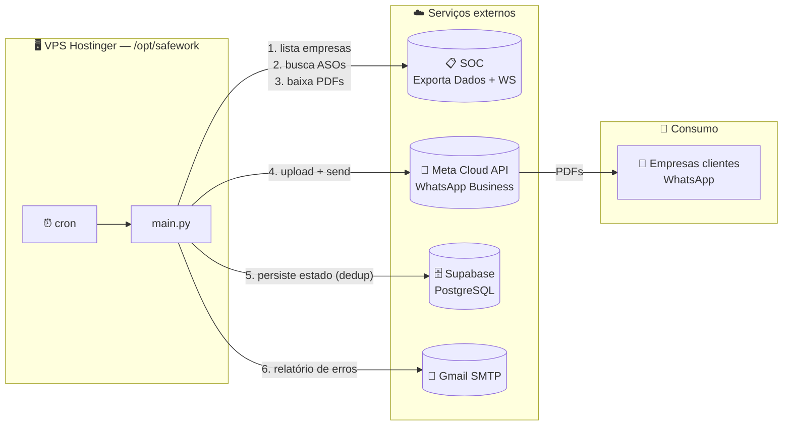
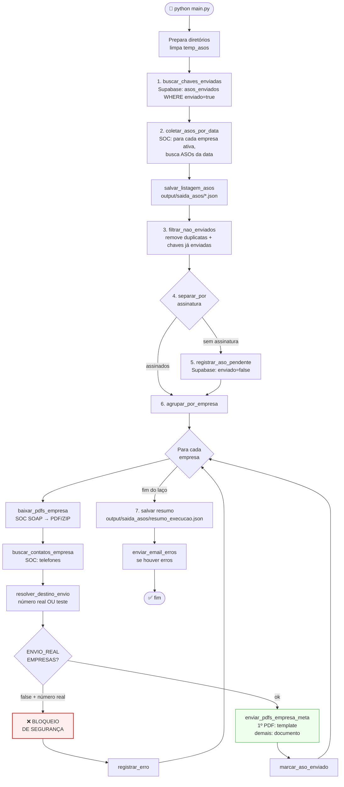
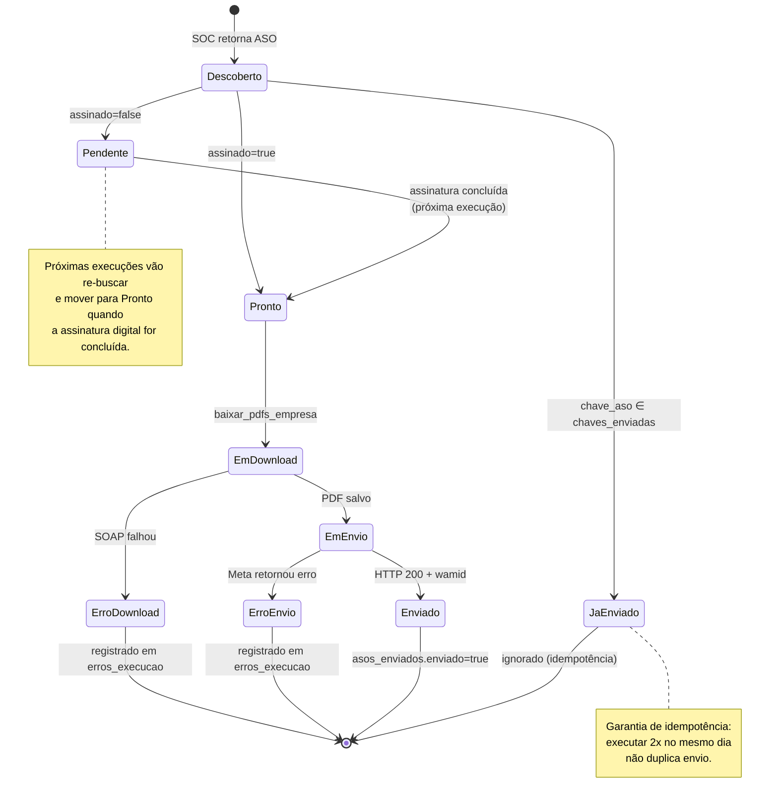
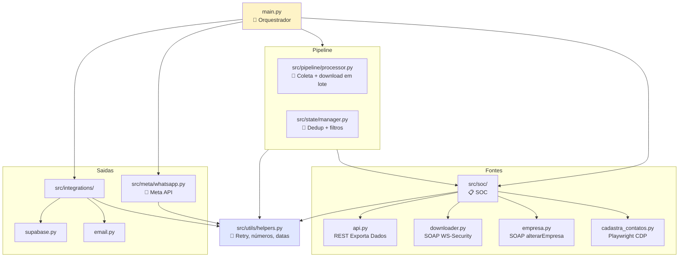
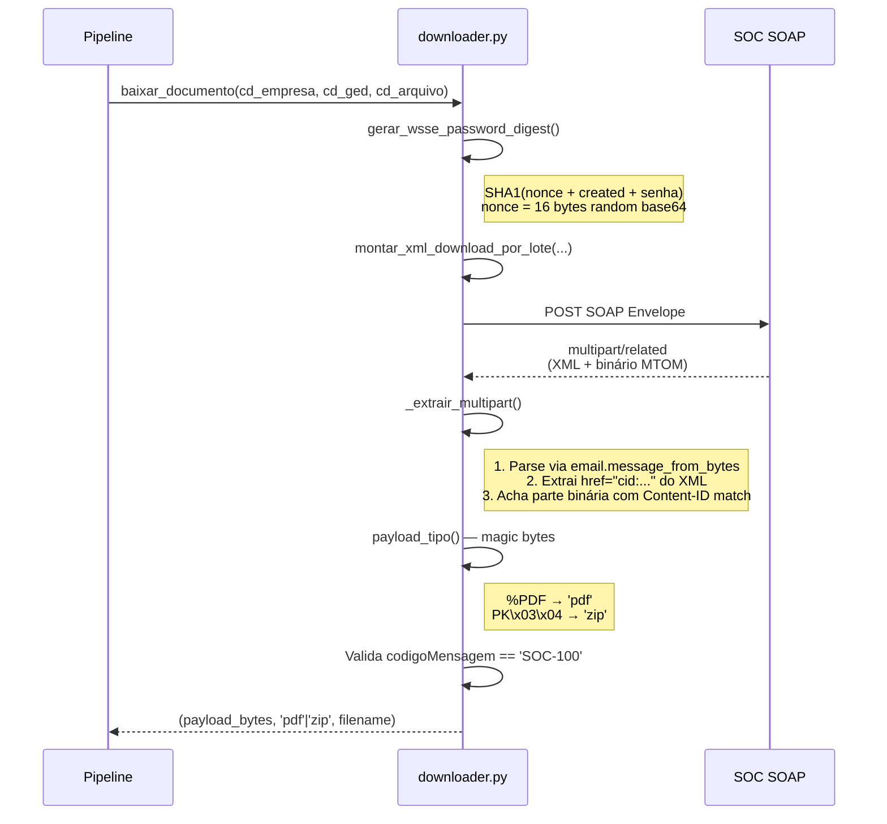
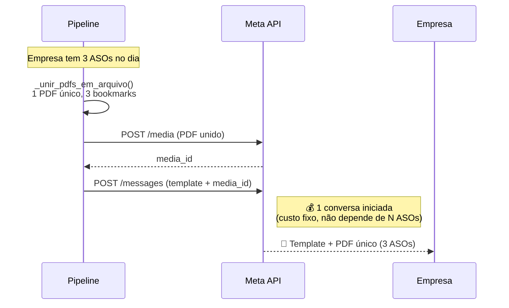
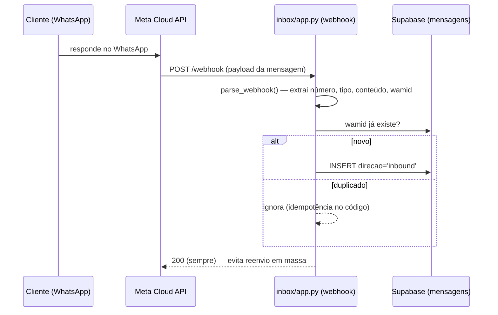

# 🏛️ Arquitetura — SafeWork ASO

Este documento descreve **como** o pipeline funciona por dentro: o fluxo de dados, os contratos entre módulos, o modelo de dados externo e os pontos de falha esperados.

Para visão de produto e como rodar, veja o [README.md](README.md).

---

## 📑 Sumário

1. [Diagrama de contexto](#1-diagrama-de-contexto)
2. [Fluxo de execução do `main.py`](#2-fluxo-de-execução-do-mainpy)
3. [Estados de um ASO](#3-estados-de-um-aso)
4. [Camadas e responsabilidades](#4-camadas-e-responsabilidades)
5. [Modelo de dados (Supabase)](#5-modelo-de-dados-supabase)
6. [Integração com a API do SOC](#6-integração-com-a-api-do-soc)
7. [Estratégia de envio WhatsApp](#7-estratégia-de-envio-whatsapp)
8. [Tratamento de erros e retries](#8-tratamento-de-erros-e-retries)
9. [Decisões de design](#9-decisões-de-design)
10. [Inbox — recepção e visualização de mensagens](#10-inbox--recepção-e-visualização-de-mensagens)

---

## 1. Diagrama de contexto



> Fluxo do pipeline é **send-only**: entrega o ASO e persiste o estado de envio, sem nunca ler respostas. A recepção de respostas dos clientes é feita por um serviço **separado e read-only** (o **Inbox**, seção 10), que não realimenta o pipeline.

---

## 2. Fluxo de execução do `main.py`

Toda execução é determinística e segue **sete etapas numeradas explicitamente no código-fonte**:



> 📌 Cada caixa azul é uma etapa numerada explicitamente no `main.py`. Use os números (`# ── N. Descrição ──`) para localizar.

---

## 3. Estados de um ASO



**Chave de identidade**: `CD_EMPRESA | CD_GED | CD_ARQUIVO_GED` (campos do SOC). Construída em `src/state/manager.py:chave_aso()`.

---

## 4. Camadas e responsabilidades

Cada módulo tem uma **única** razão para existir. A regra: `src/soc/` não importa `src/meta/`, e vice-versa. O `main.py` é o único ponto que conhece todos.



### Por que essa separação importa

- **Trocar de provedor SOC** afeta só `src/soc/` (e o nome dos campos no `main.py`).
- **Trocar de WhatsApp para Telegram** afeta só `src/meta/` (e a flag de envio no `main.py`).
- **Adicionar uma nova integração de log** entra como mais um arquivo em `src/integrations/` sem mexer no resto.

### Módulos novos em `src/soc/`

**`empresa.py`** — atualiza dados cadastrais de uma empresa no SOC via WebService SOAP `alterarEmpresa` (WSDL: `EmpresaWs`). Reutiliza `gerar_wsse_password_digest()` do `downloader.py`. Retorna `ResultadoWs` com código SOC-100/200/206/207.

**`cadastra_contatos.py`** — automação de UI via Playwright CDP. Lê empresas de um Google Forms (via Google Sheets API + service account) ou CSV, navega pela estrutura de iframes do SOC (socframe → cadIFrame), abre a tela de Contatos (480) de cada empresa e preenche nome, telefone e e-mail. Detecta duplicatas via dialog nativo do browser. Não roda na VPS — depende de Chrome local já autenticado.

---

## 5. Modelo de dados (Supabase)

> **Não há tabela de cadastro de empresas.** O telefone de cada empresa vem
> exclusivamente do **exportador de contatos do SOC** (`buscar_contatos_empresa`,
> exportador `193815`) na hora do envio. O bloqueio de empresas é uma lista fixa
> no código (`EMPRESAS_BLOQUEADAS` em `config.py`). O Supabase guarda só o estado
> de envio (`asos_enviados`) e as mensagens do Inbox (`mensagens`).

### Tabela `asos_enviados`

Controle de quem foi enviado, quando, para quem. Único índice em `chave_aso` garante a idempotência.

| Coluna | Tipo | Notas |
|---|---|---|
| `id` | int8 PK | |
| `chave_aso` | text **UNIQUE** | `CD_EMPRESA\|CD_GED\|CD_ARQUIVO_GED` |
| `cd_empresa_soc` | text | Redundante para query, espelha parte da chave |
| `cd_ged`, `cd_arquivo_ged` | text | Idem |
| `codigo_empresa` | text | Código da empresa no SOC (sem FK) |
| `nome_empresa` | text | |
| `nome_arquivo` | text | Nome do PDF enviado |
| `data_envio` | date | YYYY-MM-DD |
| `data_emissao` | date | YYYY-MM-DD |
| `assinado` | bool | `true` quando enviado |
| `enviado` | bool | `true` apenas após sucesso na Meta |
| `numero_destino` | text | Para onde foi (real ou teste) |
| `wamid` | text | ID retornado pela Meta |
| `status` | text | `pendente` \| `enviado` |
| `created_at` | timestamptz | |

---

## 6. Integração com a API do SOC

O SOC tem **duas portas distintas** que o sistema consome:

### 6.1. Exporta Dados (REST simples)

Endpoint: `https://ws1.soc.com.br/WebSoc/exportadados`

```http
GET /WebSoc/exportadados?parametro={"empresa":"289501","codigo":"192392","chave":"...","tipoSaida":"json"}
```

Usado para listar **empresas**, **ASOs** e **contatos** — três códigos diferentes:

| Tipo | Código exportador | Variável de chave |
|---|---|---|
| Empresas | `192392` | `SOC_CHAVE_EMPRESAS` |
| GED (ASOs) | `191710` | `SOC_CHAVE_GED` |
| Contatos | `193815` | `SOC_CHAVE_CONTATOS` |

Resposta de erro do SOC nunca vem como HTTP 4xx/5xx — vem como JSON `{"erro": true, "mensagem Erro": "..."}`. O cliente (`chamar_exporta_dados`) detecta isso e lança `RuntimeError`.

### 6.2. Download de GED (SOAP + WS-Security + MTOM)

Endpoint: `https://ws1.soc.com.br/WSSoc/DownloadArquivosWs`

Aqui está a parte cabeluda. O fluxo:



**Pontos finos do parser SOAP:**

- Resposta vem em **multipart/related** com referência por `Content-ID` (MTOM).
- O XML aponta para o anexo via `href="cid:..."` — esse é o caminho preferencial para escolher qual parte é "o documento".
- Fallback: se não houver `href`, varre os anexos e escolhe a primeira parte cujos magic bytes sejam PDF ou ZIP.
- **ZIPs são extraídos em runtime** (`processor.py:baixar_pdfs_empresa`) — o SOC eventualmente devolve um ZIP contendo um único PDF.

**Quando dá errado**, todos os dados crus vão para `output/debug_downloads/`:

```
debug_downloads/
├── <chave>_xml.txt         # XML da resposta
├── <chave>_partes.json     # metadados de cada parte multipart
└── <chave>_payload.bin     # o binário extraído (ou nada)
```

---

## 7. Estratégia de envio WhatsApp

A Meta cobra por **conversa iniciada** dentro de uma janela de 24h. Para evitar que uma empresa com vários ASOs no mesmo dia gere várias conversas cobradas, todos os PDFs da empresa são **unidos num único arquivo** (um bookmark por funcionário, via `_unir_pdfs_em_arquivo`) e enviados como **uma única mensagem de template** — sempre 1 conversa por empresa por dia, independente de quantos ASOs existam:



Implementado em `src/meta/whatsapp.py:enviar_pdfs_empresa_meta`. Se a união de PDFs falhar para um arquivo individual, esse arquivo é pulado (erro registrado) mas os demais continuam entrando no PDF único — só falha tudo se **nenhum** PDF puder ser incluído. Antes de enviar, roda `_fazer_upload_pdf` (media_id) e, se o envio do template falhar, o arquivo temporário unido é removido do disco de qualquer forma (`finally: os.remove`).

---

## 8. Tratamento de erros e retries

### Camada de transporte (`_requisicao_com_retry`)

```python
# src/utils/helpers.py
- 3 tentativas
- backoff exponencial: 2s, 4s, 8s
- retry em: ConnectionError, Timeout, HTTP 5xx
- NÃO retry em: HTTP 4xx (erros de cliente)
```

### Camada de domínio

Falhas em **uma empresa** não interrompem o lote:

```python
try:
    enviar_pdfs_empresa_meta(...)
except Exception as e:
    resultado["meta_erro"] = str(e)
    registrar_erro(f"Empresa {codigo_empresa} erro envio Meta: {e}")
# segue para a próxima empresa
```

Erros são acumulados em `erros_execucao` (lista global em `helpers.py`) e disparados por email no `finally` do `main`.

### Camada de orquestração

O `main()` inteiro está dentro de um `try/except/finally`:

```python
try:
    main(usar_ontem=args.ontem)
except Exception as e:
    registrar_erro(f"Erro geral na execução: {e}")
    raise           # propaga para o cron logar
finally:
    enviar_email_erros(erros_execucao)   # SEMPRE dispara o email
```

Resultado: **mesmo em crash catastrófico**, o relatório de erros sai.

---

## 9. Decisões de design

### Por que Português no código?

Domínio fortemente brasileiro: SOC, ASO, CNPJ, ESocial. Traduzir vira "Health Certificate" e perde o significado. Os campos da API do SOC já vêm em português (`EMPRESA_CONSULTADA`, `DT_EMISSAO`, `CD_GED`), então a base já está nesse idioma — misturar seria pior.

### Por que PostgREST direto em vez do client `supabase-py`?

`supabase-py` traz mais dependências, faz pool de conexões que não precisamos para 1 execução/dia, e a API REST do PostgREST é suficiente. Poucos endpoints, todos com `requests.post/get` simples.

### Por que limpar `temp_asos/` a cada execução?

Garante reprodutibilidade: a próxima execução não vê PDFs de execuções anteriores. A pasta `debug_downloads/` **não** é limpa porque é evidência forense para troubleshooting.

### Por que separar `chave_aso` em três campos no banco?

A chave composta `CD_EMPRESA|CD_GED|CD_ARQUIVO_GED` é ótima para uniqueness, mas terrível para queries do tipo "todos os ASOs da empresa X". Separar permite indexar e filtrar individualmente sem parsing.

---

## 10. CRM — recepção e visualização (Inbox de ASOs)

Serviço **independente** do pipeline (pasta `inbox/`), **read-only** do ponto de vista do negócio: recebe as respostas dos clientes e mostra tudo num CRM de **3 abas** (Dashboard, Conversas, ASOs). Não altera o pipeline nem responde mensagens.

### 10.1. Por que um app próprio (e não Chatwoot / o CRM antigo)

Read-only, solo, baixo volume. Chatwoot exigiria infra pesada 24/7. E o **CRM antigo** (que rodava em `/CrmEnvioAso`, nginx) falava com o Supabase **direto do navegador** (chave exposta) e dependia da tabela `empresas`. Este serviço o **substitui**: mesmo visual, mas **server-side** (a SPA só consome a API JSON do próprio backend; a `service_role` nunca sai do servidor) e **sem `empresas`**. O CRM antigo foi aposentado.

### 10.2. Fluxo do webhook (inbound)



- **Verificação (GET /webhook):** responde ao `hub.challenge` se `hub.verify_token == WEBHOOK_VERIFY_TOKEN`; senão 403.
- **Idempotência:** feita **no código** (checa `wamid` antes de inserir). Não há índice `UNIQUE` em `mensagens.wamid` porque o legado tem duplicados/nulos — criar o índice quebraria.
- **`statuses` ignorados:** recibos de entrega/leitura dos nossos envios não são processados na v1.

### 10.3. Reaproveitamento da tabela `mensagens`

Não foi criada tabela nova. A `mensagens` (legado do bot removido) já tem o formato certo: `direcao`, `numero_whatsapp`, `tipo`, `conteudo`, `nome_arquivo`, `wamid`, `timestamp_meta` (em **milissegundos**). O webhook grava inbound aqui; o `nome_perfil` (push name) vai em `nome_empresa`, seguindo a convenção legada. A tabela não tem coluna para mídia/payload bruto — esses campos são descartados.

### 10.4. Conversa por número (não por empresa)

A chave de agrupamento é o **número de telefone**, como no WhatsApp. A empresa é só um rótulo resolvido na leitura a partir de `asos_enviados` (campo `nome_empresa`). Um número pode carregar N empresas (todas viram etiquetas) e continua sendo **uma thread só**. Sem match → thread aparece como "não associada".

**Tolerância ao 9º dígito:** a Meta às vezes entrega o número sem o nono dígito. `variantes_numero()` gera as duas formas (com e sem o 9) e o casamento usa `in.(...)`; `chave_conversa()` normaliza para a forma mais longa, garantindo que envio e resposta caiam na mesma conversa.

### 10.5. Dashboard e deploy

- **CRM (SPA de 3 abas)**: a raiz (`/`) serve uma single-page app que consome uma **API JSON própria** do backend:
  - `GET /api/dashboard?inicio&fim&empresa` — KPIs (total, hoje, média/empresa, média diária, empresas atendidas), série de 30 dias e top empresas (gráficos **SVG inline**, sem CDN), recentes. Calculado de `asos_enviados`.
  - `GET /api/conversas` + `GET /api/conversa/{numero}` — conversas por número (timeline mesclando `asos_enviados` e `mensagens`). Envios renderizados como o cliente recebeu: card do PDF + corpo do template (`{{1}}`=empresa, `{{2}}`=data), agrupando os N ASOs de um mesmo envio numa bolha.
  - `GET /api/asos?status&q` — lista Enviados/Pendentes/Todos de `asos_enviados`.
  O front nunca fala com o Supabase direto; a `service_role` fica no backend. `_get_all` pagina em blocos grandes (o projeto Supabase não limita a 1000/req), então cada aba carrega em ~1s.
- **Deploy:** container na rede `n8n_default`, atrás do Traefik (`certresolver=mytlschallenge`), host `inbox.srv1564091.hstgr.cloud`. Dois routers no mesmo serviço: `/webhook` **sem** auth (a Meta não manda credenciais) e o resto com **Basic Auth** (middleware do Traefik). Código montado por volume `:ro` — `git pull` atualiza sem rebuild.

---

<div align="center">

Voltar ao [README.md](README.md)

</div>
