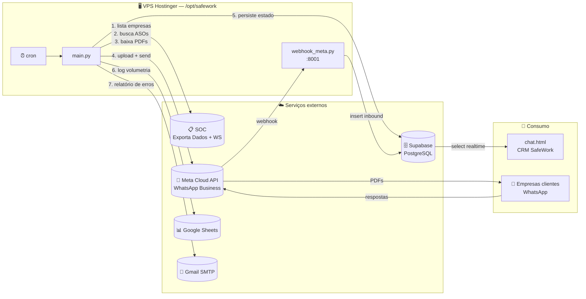
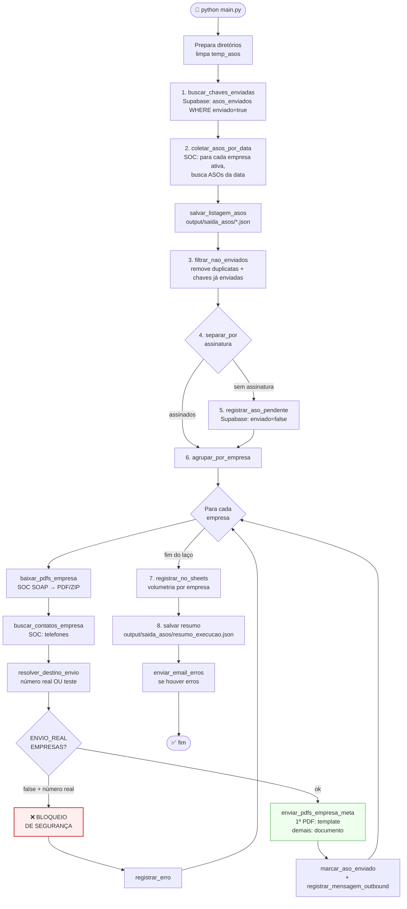
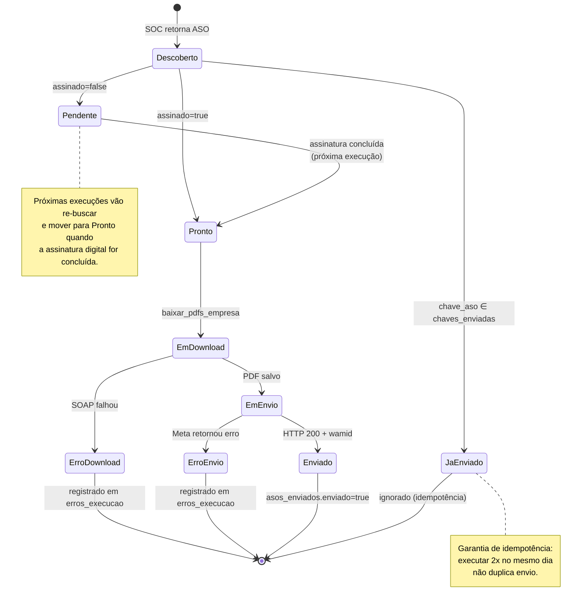
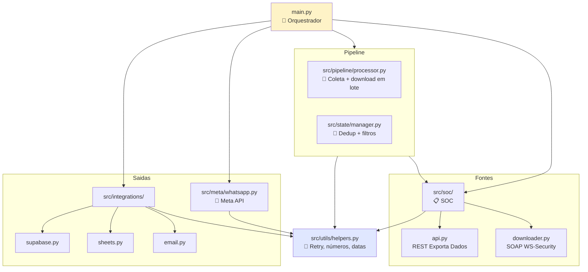
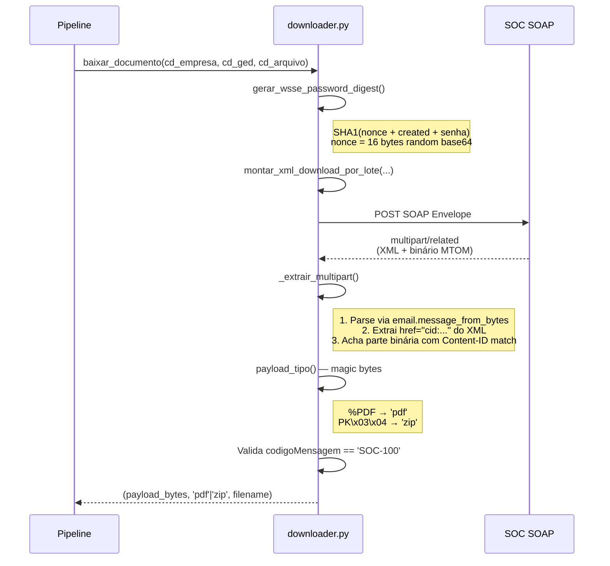
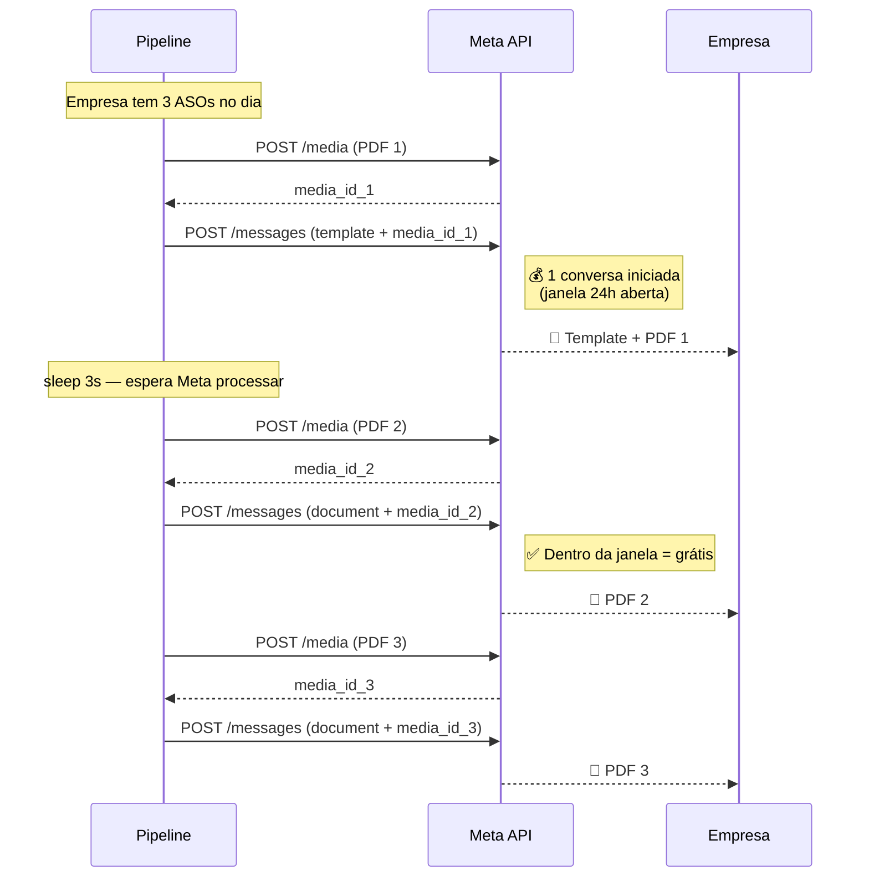
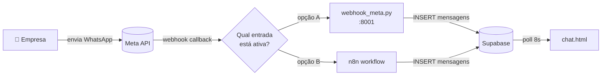

# 🏛️ Arquitetura — SafeWork ASO

Este documento descreve **como** o pipeline funciona por dentro: o fluxo de dados, os contratos entre módulos, o modelo de dados externo e os pontos de falha esperados.

Para visão de produto e como rodar, veja o [README.md](README.md).

---

## 📑 Sumário

1. [Diagrama de contexto](#1-diagrama-de-contexto)
2. [Fluxo de execução do `main.py`](#2-fluxo-de-execução-do-mainpy)
3. [Estados de um ASO](#3-estados-de-um-aso)
4. [Camadas e responsabilidades](#4-camadas-e-responsabilidades)
5. [Modelo de dados (Supabase)](#5-modelo-de-dados-supabase)
6. [Integração com a API do SOC](#6-integração-com-a-api-do-soc)
7. [Estratégia de envio WhatsApp](#7-estratégia-de-envio-whatsapp)
8. [Webhook inbound (Meta → CRM)](#8-webhook-inbound-meta-crm)
9. [Tratamento de erros e retries](#9-tratamento-de-erros-e-retries)
10. [Decisões de design](#10-decisões-de-design)

---

## 1. Diagrama de contexto



---

## 2. Fluxo de execução do `main.py`

Toda execução é determinística e segue **oito etapas numeradas explicitamente no código-fonte**:



> 📌 Cada caixa azul é uma etapa numerada explicitamente no `main.py`. Use os números (`# ── N. Descrição ──`) para localizar.

---

## 3. Estados de um ASO



**Chave de identidade**: `CD_EMPRESA | CD_GED | CD_ARQUIVO_GED` (campos do SOC). Construída em `src/state/manager.py:chave_aso()`.

---

## 4. Camadas e responsabilidades

Cada módulo tem uma **única** razão para existir. A regra: `src/soc/` não importa `src/meta/`, e vice-versa. O `main.py` é o único ponto que conhece todos.



### Por que essa separação importa

- **Trocar de provedor SOC** afeta só `src/soc/` (e o nome dos campos no `main.py`).
- **Trocar de WhatsApp para Telegram** afeta só `src/meta/` (e a flag de envio no `main.py`).
- **Adicionar uma nova integração de log** entra como mais um arquivo em `src/integrations/` sem mexer no resto.

---

## 5. Modelo de dados (Supabase)

### Tabela `empresas`

Cadastro mestre. Upsert em `upsert_empresa()` (PostgREST com `Prefer: resolution=merge-duplicates`, conflito em `codigo`).

| Coluna | Tipo | Notas |
|---|---|---|
| `id` | int8 PK | |
| `codigo` | text **UNIQUE** | Código da empresa no SOC |
| `nome` | text | Razão social ou nome abreviado |
| `cnpj` | text | |
| `telefone` | text | Telefone normalizado WhatsApp (com `55`) |
| `created_at`, `updated_at` | timestamptz | |

### Tabela `asos_enviados`

Controle de quem foi enviado, quando, para quem. Único índice em `chave_aso` garante a idempotência.

| Coluna | Tipo | Notas |
|---|---|---|
| `id` | int8 PK | |
| `chave_aso` | text **UNIQUE** | `CD_EMPRESA\|CD_GED\|CD_ARQUIVO_GED` |
| `cd_empresa_soc` | text | Redundante para query, espelha parte da chave |
| `cd_ged`, `cd_arquivo_ged` | text | Idem |
| `codigo_empresa` | text FK → empresas.codigo | |
| `nome_empresa` | text | |
| `nome_arquivo` | text | Nome do PDF enviado |
| `data_envio` | date | YYYY-MM-DD |
| `data_emissao` | date | YYYY-MM-DD |
| `assinado` | bool | `true` quando enviado |
| `enviado` | bool | `true` apenas após sucesso na Meta |
| `numero_destino` | text | Para onde foi (real ou teste) |
| `wamid` | text | ID retornado pela Meta |
| `status` | text | `pendente` \| `enviado` |
| `created_at` | timestamptz | |

### Tabela `mensagens`

Histórico bidirecional para o CRM `chat.html`. Append-only.

| Coluna | Tipo | Notas |
|---|---|---|
| `id` | int8 PK | |
| `codigo_empresa` | text | Pode ser null para inbound de número não cadastrado |
| `nome_empresa` | text | Em inbound sem cadastro, vira o nome do perfil WhatsApp |
| `numero_whatsapp` | text | Chave de agrupamento das conversas no CRM |
| `direcao` | text | `inbound` \| `outbound` |
| `tipo` | text | `text` \| `document` \| `image` \| etc |
| `conteudo` | text | Mensagem ou descrição |
| `nome_arquivo` | text | Quando `tipo=document` |
| `wamid` | text | ID da Meta para correlação |
| `timestamp_meta` | int8 | Epoch ms do servidor Meta (inbound) |
| `created_at` | timestamptz | |

> ⚠️ **RLS recomendado**: ative Row Level Security e crie policies. A publishable key do CRM, sem RLS, deixa todas as conversas legíveis por qualquer um que tenha o URL do projeto.

---

## 6. Integração com a API do SOC

O SOC tem **duas portas distintas** que o sistema consome:

### 6.1. Exporta Dados (REST simples)

Endpoint: `https://ws1.soc.com.br/WebSoc/exportadados`

```http
GET /WebSoc/exportadados?parametro={"empresa":"289501","codigo":"192392","chave":"...","tipoSaida":"json"}
```

Usado para listar **empresas**, **ASOs** e **contatos** — três códigos diferentes:

| Tipo | Código exportador | Variável de chave |
|---|---|---|
| Empresas | `192392` | `SOC_CHAVE_EMPRESAS` |
| GED (ASOs) | `191710` | `SOC_CHAVE_GED` |
| Contatos | `193815` | `SOC_CHAVE_CONTATOS` |

Resposta de erro do SOC nunca vem como HTTP 4xx/5xx — vem como JSON `{"erro": true, "mensagem Erro": "..."}`. O cliente (`chamar_exporta_dados`) detecta isso e lança `RuntimeError`.

### 6.2. Download de GED (SOAP + WS-Security + MTOM)

Endpoint: `https://ws1.soc.com.br/WSSoc/DownloadArquivosWs`

Aqui está a parte cabeluda. O fluxo:



**Pontos finos do parser SOAP:**

- Resposta vem em **multipart/related** com referência por `Content-ID` (MTOM).
- O XML aponta para o anexo via `href="cid:..."` — esse é o caminho preferencial para escolher qual parte é "o documento".
- Fallback: se não houver `href`, varre os anexos e escolhe a primeira parte cujos magic bytes sejam PDF ou ZIP.
- **ZIPs são extraídos em runtime** (`processor.py:baixar_pdfs_empresa`) — o SOC eventualmente devolve um ZIP contendo um único PDF.

**Quando dá errado**, todos os dados crus vão para `output/debug_downloads/`:

```
debug_downloads/
├── <chave>_xml.txt         # XML da resposta
├── <chave>_partes.json     # metadados de cada parte multipart
└── <chave>_payload.bin     # o binário extraído (ou nada)
```

---

## 7. Estratégia de envio WhatsApp

A Meta cobra por **conversa iniciada** dentro de uma janela de 24h. Para empresas com vários ASOs no mesmo dia, mandar cada PDF separadamente custaria N conversas. A estratégia minimiza isso para **1 conversa por empresa por dia**:



Implementado em `src/meta/whatsapp.py:enviar_pdfs_empresa_meta`. Se o primeiro envio (template) falhar, o restante **não** é tentado — falha cedo evita gastar a janela de 24h em conversa que não vai render.

---

## 8. Webhook inbound (Meta → CRM)

Mensagens que as empresas mandam de volta passam por **um dos dois caminhos** (não os dois):



Os dois fazem essencialmente a mesma coisa:

1. Valida o `verify_token` no GET inicial da Meta.
2. No POST do callback, valida HMAC SHA256 (opcional) e o `phone_number_id` (filtro de segurança — ignora mensagens de outros números do mesmo app).
3. Tenta resolver o número remetente em `empresas.telefone` para preencher `codigo_empresa` e `nome_empresa`.
4. Insere em `mensagens` com `direcao=inbound`.

**Decisão a tomar em produção**: manter `webhook_meta.py` (servidor Python nativo, sem dependências) **ou** o n8n (mais visual, mais fácil de ramificar com lógica adicional). Não rodar os dois simultaneamente apontando para o mesmo número — dupliça as mensagens.

---

## 9. Tratamento de erros e retries

### Camada de transporte (`_requisicao_com_retry`)

```python
# src/utils/helpers.py
- 3 tentativas
- backoff exponencial: 2s, 4s, 8s
- retry em: ConnectionError, Timeout, HTTP 5xx
- NÃO retry em: HTTP 4xx (erros de cliente)
```

### Camada de domínio

Falhas em **uma empresa** não interrompem o lote:

```python
try:
    enviar_pdfs_empresa_meta(...)
except Exception as e:
    resultado["meta_erro"] = str(e)
    registrar_erro(f"Empresa {codigo_empresa} erro envio Meta: {e}")
# segue para a próxima empresa
```

Erros são acumulados em `erros_execucao` (lista global em `helpers.py`) e disparados por email no `finally` do `main`.

### Camada de orquestração

O `main()` inteiro está dentro de um `try/except/finally`:

```python
try:
    main(usar_ontem=args.ontem)
except Exception as e:
    registrar_erro(f"Erro geral na execução: {e}")
    raise           # propaga para o cron logar
finally:
    enviar_email_erros(erros_execucao)   # SEMPRE dispara o email
```

Resultado: **mesmo em crash catastrófico**, o relatório de erros sai.

---

## 10. Decisões de design

### Por que Português no código?

Domínio fortemente brasileiro: SOC, ASO, CNPJ, ESocial. Traduzir vira "Health Certificate" e perde o significado. Os campos da API do SOC já vêm em português (`EMPRESA_CONSULTADA`, `DT_EMISSAO`, `CD_GED`), então a base já está nesse idioma — misturar seria pior.

### Por que JWT manual no Sheets em vez de `google-auth`?

Para manter o `requirements.txt` minúsculo (3 libs). Service Account JWT é simples: header + payload + RSA-SHA256, e `cryptography` já estava lá para outra coisa. Adicionar `google-auth` traria dezenas de dependências transitivas para uma função.

### Por que `http.server` nativo no webhook?

Mesmo motivo. O endpoint tem três coisas: validar token, validar HMAC, fazer INSERT. FastAPI + uvicorn + Pydantic seria over-engineering para 95 linhas.

> Quando o webhook crescer (filas, validações complexas, múltiplos endpoints), migrar para FastAPI vale a pena. **Está no roadmap**.

### Por que PostgREST direto em vez do client `supabase-py`?

`supabase-py` traz mais dependências, faz pool de conexões que não precisamos para 1 execução/dia, e a API REST do PostgREST é suficiente. Cinco endpoints, todos com `requests.post/get` simples.

### Por que limpar `temp_asos/` a cada execução?

Garante reprodutibilidade: a próxima execução não vê PDFs de execuções anteriores. A pasta `debug_downloads/` **não** é limpa porque é evidência forense para troubleshooting.

### Por que separar `chave_aso` em três campos no banco?

A chave composta `CD_EMPRESA|CD_GED|CD_ARQUIVO_GED` é ótima para uniqueness, mas terrível para queries do tipo "todos os ASOs da empresa X". Separar permite indexar e filtrar individualmente sem parsing.

---

<div align="center">

Voltar ao [README.md](README.md)

</div>
